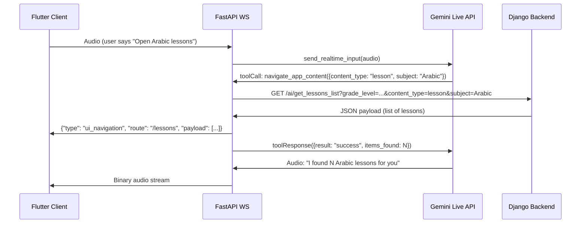

# Voice-Driven App Navigation — Implementation Walkthrough

## Summary

Implemented Gemini WebSocket Tool Calling for voice-driven app navigation, enabling visually impaired users to say things like *"Open Arabic lessons"* and have the app navigate automatically.

## Files Changed

### 1. [config.py](file:///c:/Users/borhen/Desktop/EduVoice_AI/app/core/config.py)

```diff:config.py
import os
from dotenv import load_dotenv

load_dotenv()

SERVER_HOST = os.getenv("SERVER_HOST", "127.0.0.1")
SERVER_PORT = int(os.getenv("SERVER_PORT", "8000"))
DEBUG_MODE = os.getenv("DEBUG_MODE", "True").lower() == "true"
LOG_LEVEL = os.getenv("LOG_LEVEL", "DEBUG")
GEMINI_API_KEY = os.getenv("GEMINI_API_KEY")
GEMINI_API_KEY_FALLBACK = os.getenv("GEMINI_API_KEY_FALLBACK")

# Model supporting live streaming
MODEL_NAME = os.getenv("MODEL_NAME", "gemini-3.1-flash-live-preview")
MODEL_NAME_FALLBACK = os.getenv("MODEL_NAME_FALLBACK", "gemini-2.5-flash")

if not GEMINI_API_KEY or not GEMINI_API_KEY.startswith("AIza"):
    import sys
    print("CRITICAL ERROR: Invalid GEMINI_API_KEY in .env file.")
    sys.exit(1)
===
import os
from dotenv import load_dotenv

load_dotenv()

SERVER_HOST = os.getenv("SERVER_HOST", "127.0.0.1")
SERVER_PORT = int(os.getenv("SERVER_PORT", "8000"))
DEBUG_MODE = os.getenv("DEBUG_MODE", "True").lower() == "true"
LOG_LEVEL = os.getenv("LOG_LEVEL", "DEBUG")
GEMINI_API_KEY = os.getenv("GEMINI_API_KEY")
GEMINI_API_KEY_FALLBACK = os.getenv("GEMINI_API_KEY_FALLBACK")

# Model supporting live streaming
MODEL_NAME = os.getenv("MODEL_NAME", "gemini-3.1-flash-live-preview")
MODEL_NAME_FALLBACK = os.getenv("MODEL_NAME_FALLBACK", "gemini-2.5-flash")

# Django backend URL for fetching app content (lessons, podcasts, etc.)
DJANGO_BACKEND_URL = os.getenv("DJANGO_BACKEND_URL", "https://radio.backend.ecocloud.tn/ai/get_lessons_list")

if not GEMINI_API_KEY or not GEMINI_API_KEY.startswith("AIza"):
    import sys
    print("CRITICAL ERROR: Invalid GEMINI_API_KEY in .env file.")
    sys.exit(1)
```

Added `DJANGO_BACKEND_URL` env variable with default `https://radio.backend.ecocloud.tn/ai/get_lessons_list`.

---

### 2. [.env.example](file:///c:/Users/borhen/Desktop/EduVoice_AI/.env.example)

```diff:.env.example
# ──────────────────────────────────────────────────────────────
# EduVoice AI — Environment Variables
# Copy this file to .env and fill in your values
# ──────────────────────────────────────────────────────────────

# Google AI Studio API Key (Get it from: https://aistudio.google.com/app/apikey)
GEMINI_API_KEY=your-primary-api-key-here
GEMINI_API_KEY_FALLBACK=your-fallback-api-key-here

# Server Configuration
SERVER_HOST=0.0.0.0
SERVER_PORT=8000

# Application Settings
DEBUG_MODE=False
LOG_LEVEL=INFO

# Model Configuration
MODEL_NAME=gemini-3.1-flash-live-preview
MODEL_NAME_FALLBACK=gemini-2.5-flash
===
# ──────────────────────────────────────────────────────────────
# EduVoice AI — Environment Variables
# Copy this file to .env and fill in your values
# ──────────────────────────────────────────────────────────────

# Google AI Studio API Key (Get it from: https://aistudio.google.com/app/apikey)
GEMINI_API_KEY=your-primary-api-key-here
GEMINI_API_KEY_FALLBACK=your-fallback-api-key-here

# Server Configuration
SERVER_HOST=0.0.0.0
SERVER_PORT=8000

# Application Settings
DEBUG_MODE=False
LOG_LEVEL=INFO

# Model Configuration
MODEL_NAME=gemini-3.1-flash-live-preview
MODEL_NAME_FALLBACK=gemini-2.5-flash

# Django Backend (for voice-driven navigation / content fetching)
DJANGO_BACKEND_URL=https://radio.backend.ecocloud.tn/ai/get_lessons_list
```

Documented the new variable for other developers.

---

### 3. [websocket.py](file:///c:/Users/borhen/Desktop/EduVoice_AI/app/features/voice_session/websocket.py)

```diff:websocket.py
import asyncio
import json
from contextlib import asynccontextmanager
from fastapi import WebSocket, WebSocketDisconnect
from google import genai
from google.genai import types

from app.core.config import GEMINI_API_KEY, GEMINI_API_KEY_FALLBACK, MODEL_NAME, MODEL_NAME_FALLBACK
from app.core.logger import logger
from app.domain.models import Student
from app.features.voice_session.system_prompt import build_system_instruction

primary_client = genai.Client(api_key=GEMINI_API_KEY)
fallback_client = genai.Client(api_key=GEMINI_API_KEY_FALLBACK) if GEMINI_API_KEY_FALLBACK else None

@asynccontextmanager
async def get_gemini_session(config):
    try:
        async with primary_client.aio.live.connect(model=MODEL_NAME, config=config) as session:
            yield session
    except Exception as e:
        logger.warning(f"Primary API key failed with error: {e}. Trying fallback...")
        if fallback_client:
            async with fallback_client.aio.live.connect(model=MODEL_NAME_FALLBACK, config=config) as session:
                yield session
        else:
            raise

async def websocket_endpoint(websocket: WebSocket):
    await websocket.accept()
    client_ip = websocket.client.host

    # Read Student parameters from query
    query_params = websocket.query_params
    student_name = query_params.get("name", "Student")
    grade_level = query_params.get("grade_level", "primary_4")

    course_names_raw = query_params.get("course_names", "")
    course_names = [c.strip() for c in course_names_raw.split(",") if c.strip()] if course_names_raw else []

    student = Student(name=student_name, grade_level=grade_level, course_names=course_names)
    system_instruction_text = build_system_instruction(student)

    logger.info(f"WebSocket connection established with {client_ip} for Student: {student.name} ({student.grade_level})")

    # Configuration for the Live API
    config = types.LiveConnectConfig(
        response_modalities=[types.Modality.AUDIO], # Force Gemini to reply with Audio
        system_instruction=types.Content(
            parts=[types.Part.from_text(text=system_instruction_text)]
        )
    )

    # ---------------------------------------------------------------------------
    # Barge-in state: generation_id is incremented on every interruption so
    # the frontend can discard stale audio chunks from a cancelled generation.
    # ---------------------------------------------------------------------------
    generation_id: int = 0

    async def _send_json(msg: dict) -> None:
        """Helper to send a JSON text frame to the browser, swallowing errors."""
        try:
            await websocket.send_text(json.dumps(msg))
        except Exception:
            pass  # Connection may already be closing

    try:
        # Establish the persistent Live connection with Google
        async with get_gemini_session(config) as session:
            logger.info("Successfully connected to Gemini Live API.")

            # TASK 1: Read audio bytes from Browser -> Send to Gemini
            # The mic stream NEVER stops — this is critical for Gemini's
            # server-side VAD to detect barge-in while the model is speaking.
            audio_chunk_count = 0

            async def receive_from_browser():
                nonlocal audio_chunk_count
                try:
                    while True:
                        data = await websocket.receive_bytes()
                        audio_chunk_count += 1
                        if audio_chunk_count % 100 == 0:
                            logger.debug(f"Sent {audio_chunk_count} audio chunks to Gemini.")
                        await session.send_realtime_input(
                            audio=types.Blob(
                                data=data,
                                mime_type="audio/pcm;rate=16000"
                            )
                        )
                except WebSocketDisconnect:
                    logger.info(f"Browser disconnected after {audio_chunk_count} audio chunks.")
                except Exception as e:
                    logger.error(f"Error reading from browser: {e}", exc_info=True)

            # TASK 2: Read responses from Gemini -> Forward to Browser
            # Handles audio chunks, turn_complete, and INTERRUPTION signals.
            async def receive_from_gemini():
                nonlocal generation_id
                turn_count = 0
                try:
                    while True:
                        async for response in session.receive():
                            server_content = response.server_content

                            if server_content is None:
                                logger.debug(f"Gemini non-content message: {type(response).__name__}")
                                continue

                            # -------------------------------------------------
                            # BARGE-IN: Gemini's server-side VAD detected the
                            # user speaking while the model was generating.
                            # The server has already cancelled generation.
                            # We must tell the frontend to flush its playback.
                            # -------------------------------------------------
                            if getattr(server_content, 'interrupted', False):
                                generation_id += 1
                                logger.info(
                                    f"⚡ Barge-in detected — Gemini interrupted. "
                                    f"New generation_id={generation_id}"
                                )
                                await _send_json({
                                    "type": "interrupt",
                                    "generation_id": generation_id
                                })
                                continue

                            # Forward audio chunks to the browser, tagged with
                            # the current generation_id (4-byte big-endian header).
                            if server_content.model_turn is not None:
                                for part in server_content.model_turn.parts:
                                    if part.inline_data and part.inline_data.data:
                                        header = generation_id.to_bytes(4, 'big')
                                        await websocket.send_bytes(
                                            header + part.inline_data.data
                                        )

                            # Turn completion — natural end of the model's response
                            if server_content.turn_complete:
                                turn_count += 1
                                logger.info(f"Gemini turn #{turn_count} complete — ready for next question.")
                                await _send_json({
                                    "type": "turn_complete",
                                    "generation_id": generation_id
                                })

                except asyncio.CancelledError:
                    logger.info(f"Gemini receive task cancelled after {turn_count} turns.")
                except Exception as e:
                    logger.error(f"Error receiving from Gemini: {e}", exc_info=True)

            # Run both tasks concurrently
            browser_task = asyncio.create_task(receive_from_browser())
            gemini_task = asyncio.create_task(receive_from_gemini())

            try:
                await browser_task
            except Exception:
                pass
            finally:
                gemini_task.cancel()
                try:
                    await gemini_task
                except asyncio.CancelledError:
                    pass

    except Exception as e:
        logger.error(f"Live API Connection Failed: {e}", exc_info=True)
    finally:
        logger.info(f"WebSocket session closed for {client_ip}")
        try:
            await websocket.close()
        except:
            pass
===
import asyncio
import json
from contextlib import asynccontextmanager
from fastapi import WebSocket, WebSocketDisconnect
from google import genai
from google.genai import types
import httpx

from app.core.config import (
    GEMINI_API_KEY,
    GEMINI_API_KEY_FALLBACK,
    MODEL_NAME,
    MODEL_NAME_FALLBACK,
    DJANGO_BACKEND_URL,
)
from app.core.logger import logger
from app.domain.models import Student
from app.features.voice_session.system_prompt import build_system_instruction

primary_client = genai.Client(api_key=GEMINI_API_KEY)
fallback_client = genai.Client(api_key=GEMINI_API_KEY_FALLBACK) if GEMINI_API_KEY_FALLBACK else None

# ---------------------------------------------------------------------------
# Gemini Tool Declaration — Voice-Driven App Navigation
# ---------------------------------------------------------------------------
NAVIGATE_APP_CONTENT_TOOL = types.Tool(
    function_declarations=[
        types.FunctionDeclaration(
            name="navigate_app_content",
            description=(
                "Navigate the app to show educational content. "
                "Call this when the user asks to open, browse, or list "
                "lessons, podcasts, cultural records, or radio stations."
            ),
            parameters=types.Schema(
                type=types.Type.OBJECT,
                properties={
                    "content_type": types.Schema(
                        type=types.Type.STRING,
                        enum=["lesson", "podcast", "culture", "radio"],
                        description="The type of content to navigate to.",
                    ),
                    "subject": types.Schema(
                        type=types.Type.STRING,
                        description="Optional subject filter (e.g. 'Arabic', 'Math').",
                    ),
                    "specific_lesson_name": types.Schema(
                        type=types.Type.STRING,
                        description="Optional specific lesson or item name to open.",
                    ),
                },
                required=["content_type"],
            ),
        )
    ]
)


@asynccontextmanager
async def get_gemini_session(config):
    try:
        async with primary_client.aio.live.connect(model=MODEL_NAME, config=config) as session:
            yield session
    except Exception as e:
        logger.warning(f"Primary API key failed with error: {e}. Trying fallback...")
        if fallback_client:
            async with fallback_client.aio.live.connect(model=MODEL_NAME_FALLBACK, config=config) as session:
                yield session
        else:
            raise


async def websocket_endpoint(websocket: WebSocket):
    await websocket.accept()
    client_ip = websocket.client.host

    # Read Student parameters from query
    query_params = websocket.query_params
    student_name = query_params.get("name", "Student")
    grade_level = query_params.get("grade_level", "primary_4")

    course_names_raw = query_params.get("course_names", "")
    course_names = [c.strip() for c in course_names_raw.split(",") if c.strip()] if course_names_raw else []

    student = Student(name=student_name, grade_level=grade_level, course_names=course_names)
    system_instruction_text = build_system_instruction(student)

    logger.info(f"WebSocket connection established with {client_ip} for Student: {student.name} ({student.grade_level})")

    # Configuration for the Live API — with tool injection
    config = types.LiveConnectConfig(
        response_modalities=[types.Modality.AUDIO],  # Force Gemini to reply with Audio
        system_instruction=types.Content(
            parts=[types.Part.from_text(text=system_instruction_text)]
        ),
        tools=[NAVIGATE_APP_CONTENT_TOOL],
    )

    # ---------------------------------------------------------------------------
    # Barge-in state: generation_id is incremented on every interruption so
    # the frontend can discard stale audio chunks from a cancelled generation.
    # ---------------------------------------------------------------------------
    generation_id: int = 0

    async def _send_json(msg: dict) -> None:
        """Helper to send a JSON text frame to the browser, swallowing errors."""
        try:
            await websocket.send_text(json.dumps(msg))
        except Exception:
            pass  # Connection may already be closing

    try:
        # Establish the persistent Live connection with Google
        async with get_gemini_session(config) as session:
            logger.info("Successfully connected to Gemini Live API.")

            # TASK 1: Read audio bytes from Browser -> Send to Gemini
            # The mic stream NEVER stops — this is critical for Gemini's
            # server-side VAD to detect barge-in while the model is speaking.
            audio_chunk_count = 0

            async def receive_from_browser():
                nonlocal audio_chunk_count
                try:
                    while True:
                        data = await websocket.receive_bytes()
                        audio_chunk_count += 1
                        if audio_chunk_count % 100 == 0:
                            logger.debug(f"Sent {audio_chunk_count} audio chunks to Gemini.")
                        await session.send_realtime_input(
                            audio=types.Blob(
                                data=data,
                                mime_type="audio/pcm;rate=16000"
                            )
                        )
                except WebSocketDisconnect:
                    logger.info(f"Browser disconnected after {audio_chunk_count} audio chunks.")
                except Exception as e:
                    logger.error(f"Error reading from browser: {e}", exc_info=True)

            # TASK 2: Read responses from Gemini -> Forward to Browser
            # Handles audio chunks, turn_complete, INTERRUPTION signals,
            # and TOOL CALLS for voice-driven navigation.
            async def receive_from_gemini():
                nonlocal generation_id
                turn_count = 0
                try:
                    while True:
                        async for response in session.receive():

                            # -------------------------------------------------
                            # TOOL CALL: Gemini wants to invoke a function
                            # instead of (or before) producing audio.
                            # -------------------------------------------------
                            tool_call = response.tool_call
                            if tool_call is not None:
                                for fc in tool_call.function_calls:
                                    await _handle_tool_call(
                                        session, fc, grade_level
                                    )
                                continue

                            server_content = response.server_content

                            if server_content is None:
                                logger.debug(f"Gemini non-content message: {type(response).__name__}")
                                continue

                            # -------------------------------------------------
                            # BARGE-IN: Gemini's server-side VAD detected the
                            # user speaking while the model was generating.
                            # The server has already cancelled generation.
                            # We must tell the frontend to flush its playback.
                            # -------------------------------------------------
                            if getattr(server_content, 'interrupted', False):
                                generation_id += 1
                                logger.info(
                                    f"⚡ Barge-in detected — Gemini interrupted. "
                                    f"New generation_id={generation_id}"
                                )
                                await _send_json({
                                    "type": "interrupt",
                                    "generation_id": generation_id
                                })
                                continue

                            # Forward audio chunks to the browser, tagged with
                            # the current generation_id (4-byte big-endian header).
                            if server_content.model_turn is not None:
                                for part in server_content.model_turn.parts:
                                    if part.inline_data and part.inline_data.data:
                                        header = generation_id.to_bytes(4, 'big')
                                        await websocket.send_bytes(
                                            header + part.inline_data.data
                                        )

                            # Turn completion — natural end of the model's response
                            if server_content.turn_complete:
                                turn_count += 1
                                logger.info(f"Gemini turn #{turn_count} complete — ready for next question.")
                                await _send_json({
                                    "type": "turn_complete",
                                    "generation_id": generation_id
                                })

                except asyncio.CancelledError:
                    logger.info(f"Gemini receive task cancelled after {turn_count} turns.")
                except Exception as e:
                    logger.error(f"Error receiving from Gemini: {e}", exc_info=True)

            # ---------------------------------------------------------------
            # Tool-call handler: fetch data from Django, push UI command to
            # Flutter, and send a toolResponse back to Gemini.
            # ---------------------------------------------------------------
            async def _handle_tool_call(session, fc, grade_level: str):
                """Process a single FunctionCall from Gemini."""
                fn_name = fc.name
                args = fc.args or {}
                call_id = fc.id

                logger.info(f"🔧 Tool call received: {fn_name}({args})")

                if fn_name != "navigate_app_content":
                    logger.warning(f"Unknown tool call: {fn_name} — ignoring.")
                    return

                content_type = args.get("content_type", "lesson")
                subject = args.get("subject")
                specific_lesson_name = args.get("specific_lesson_name")

                # --- Fetch from Django backend (resilient) ---
                try:
                    request_params = {
                        "grade_level": grade_level,
                        "content_type": content_type,
                    }
                    if subject:
                        request_params["subject"] = subject
                    if specific_lesson_name:
                        request_params["specific_lesson_name"] = specific_lesson_name

                    async with httpx.AsyncClient(timeout=5.0) as http_client:
                        django_resp = await http_client.get(
                            DJANGO_BACKEND_URL,
                            params=request_params,
                        )
                        django_resp.raise_for_status()
                        payload = django_resp.json()

                    items_found = len(payload) if isinstance(payload, list) else 1

                    # Push UI navigation command to Flutter client
                    await _send_json({
                        "type": "ui_navigation",
                        "route": f"/{content_type}s",
                        "payload": payload,
                    })
                    logger.info(
                        f"✅ Sent ui_navigation to Flutter: /{content_type}s "
                        f"({items_found} items)"
                    )

                    # Acknowledge success back to Gemini
                    tool_response = types.LiveClientToolResponse(
                        function_responses=[
                            types.FunctionResponse(
                                name=fn_name,
                                id=call_id,
                                response={
                                    "result": "success",
                                    "items_found": items_found,
                                },
                            )
                        ]
                    )
                    await session.send_tool_response(tool_response)
                    logger.info(f"✅ toolResponse sent to Gemini (success, {items_found} items)")

                except (httpx.HTTPStatusError, httpx.RequestError, httpx.TimeoutException) as exc:
                    # -------------------------------------------------------
                    # RESILIENCE: Never crash the WebSocket. Instead, tell
                    # Gemini the backend is unavailable so it can verbally
                    # inform the user.
                    # -------------------------------------------------------
                    logger.error(
                        f"❌ Django backend request failed: {exc}",
                        exc_info=True,
                    )
                    error_response = types.LiveClientToolResponse(
                        function_responses=[
                            types.FunctionResponse(
                                name=fn_name,
                                id=call_id,
                                response={
                                    "result": "error",
                                    "message": "Backend unavailable",
                                },
                            )
                        ]
                    )
                    await session.send_tool_response(error_response)
                    logger.warning("⚠️ Error toolResponse sent to Gemini — session remains alive.")

            # Run both tasks concurrently
            browser_task = asyncio.create_task(receive_from_browser())
            gemini_task = asyncio.create_task(receive_from_gemini())

            try:
                await browser_task
            except Exception:
                pass
            finally:
                gemini_task.cancel()
                try:
                    await gemini_task
                except asyncio.CancelledError:
                    pass

    except Exception as e:
        logger.error(f"Live API Connection Failed: {e}", exc_info=True)
    finally:
        logger.info(f"WebSocket session closed for {client_ip}")
        try:
            await websocket.close()
        except:
            pass

```

This is the core change. Here's the architecture:



#### Key Design Decisions

| Decision | Rationale |
|---|---|
| **Tool declared as `types.Tool`** | Uses the official `google-genai` SDK types, not raw dicts — type-safe and forward-compatible |
| **`_handle_tool_call` nested inside endpoint** | Needs closure over `session`, `grade_level`, and `_send_json` — avoids parameter threading |
| **`httpx.AsyncClient(timeout=5.0)`** | Short timeout prevents the real-time audio loop from stalling if Django is slow |
| **Error → toolResponse, not WS close** | Gemini receives `{"result": "error"}` and synthesizes a verbal apology to the user |

## Zero-Downtime Guarantee

> [!IMPORTANT]
> The existing audio streaming loop (`server_content` → binary chunks → `turn_complete`) is **completely untouched**. The `toolCall` branch is a new `if` block that fires *before* the `server_content` check and uses `continue` to skip the audio path. No existing code paths were modified.

## Error Resilience

> [!NOTE]
> If the Django backend is down, times out, or returns an HTTP error:
> - The `except` block catches `httpx.HTTPStatusError`, `httpx.RequestError`, and `httpx.TimeoutException`
> - A `toolResponse` with `{"result": "error", "message": "Backend unavailable"}` is sent to Gemini
> - Gemini will verbally inform the user ("I'm sorry, I couldn't fetch the lessons right now")
> - **The WebSocket remains open** — the user can continue talking

## Validation

- ✅ Python syntax check passed (`py_compile`)
- ✅ `httpx==0.27.0` already present in `requirements.txt`
- ✅ All imports verified (`httpx`, `DJANGO_BACKEND_URL`, `types`)
